# SolidJS Real-Time Collaborative Task Board with Integrated Chat

## 📋 Table of Contents

1. [Executive Summary](#executive-summary)
2. [Application Overview](#application-overview)
3. [System Architecture](#system-architecture)
4. [Database Schema](#database-schema)
5. [Technical Implementation](#technical-implementation)
6. [Features & Capabilities](#features--capabilities)
7. [Security & Best Practices](#security--best-practices)
8. [Performance Optimization](#performance-optimization)
9. [Development Roadmap](#development-roadmap)
10. [API Reference](#api-reference)

---

## Executive Summary

### Project Vision

A production-ready, real-time collaborative task management application built with **SolidJS** and **Supabase**, featuring integrated chat functionality. This application demonstrates advanced front-end development patterns, real-time data synchronization, and modern web application architecture.

### Technology Stack

| Category | Technology | Purpose |
|----------|-----------|---------|
| Frontend Framework | SolidJS 1.8+ | Fine-grained reactivity, efficient rendering |
| Backend/Database | Supabase | PostgreSQL, Auth, Realtime, Storage |
| Build Tool | Vite 5+ | Fast development, optimized builds |
| Styling | Tailwind CSS | Utility-first responsive design |
| Type Safety | TypeScript 5+ | Type safety and better DX |
| State Management | SolidJS Stores | Fine-grained reactive state |
| Routing | @solidjs/router | Client-side routing |
| Testing | Vitest + Playwright | Unit and E2E testing |

### Key Metrics

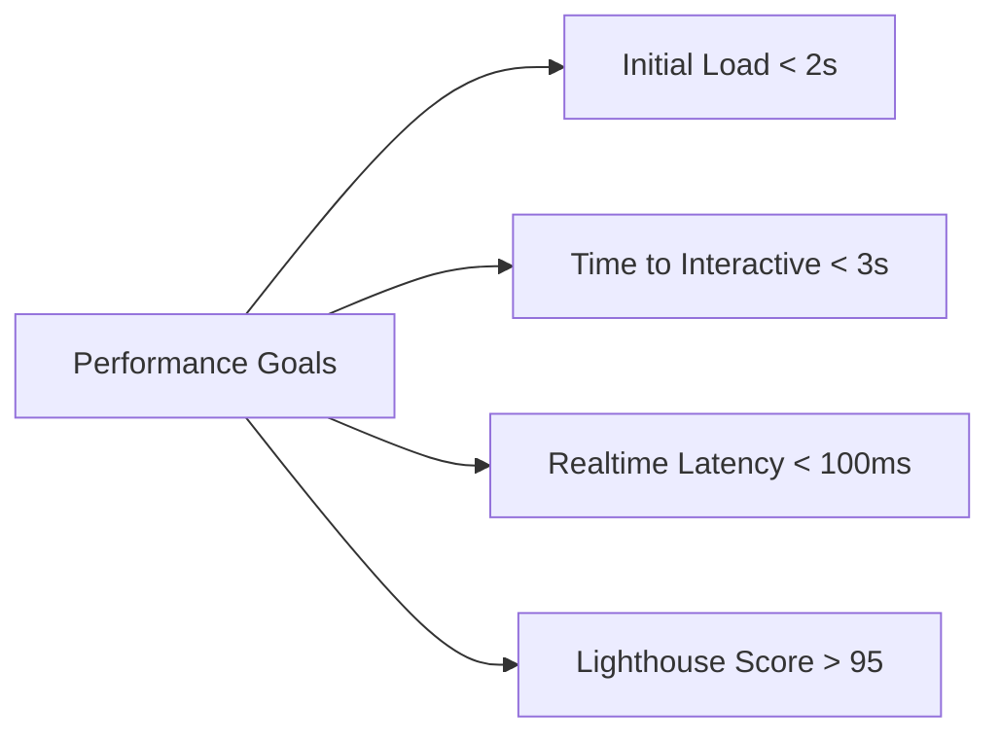

---

## Application Overview

### Core Concept

A Kanban-style task management board with integrated real-time chat, powered by Supabase for authentication, database, and real-time subscriptions. Users can collaborate on tasks while communicating through context-aware chat channels.

### Why This Solution?

- ✅ **Real Real-Time Collaboration**: Actual multi-user experience via Supabase Realtime
- ✅ **Full-Stack Demonstration**: Shows integration skills with modern backend services
- ✅ **Complex State Synchronization**: Multiple real-time data streams (tasks + chat)
- ✅ **Production-Ready Architecture**: Demonstrates scalable patterns with authentication
- ✅ **SolidJS at Scale**: Handles concurrent updates from database and user interactions

---

## System Architecture

### High-Level Architecture

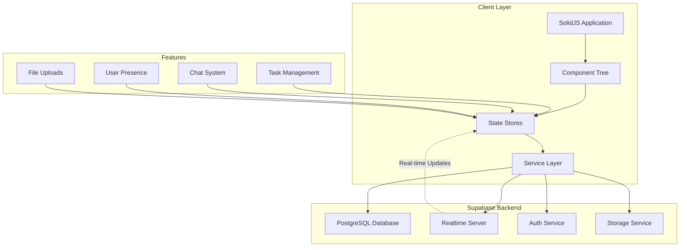

### Data Flow Architecture

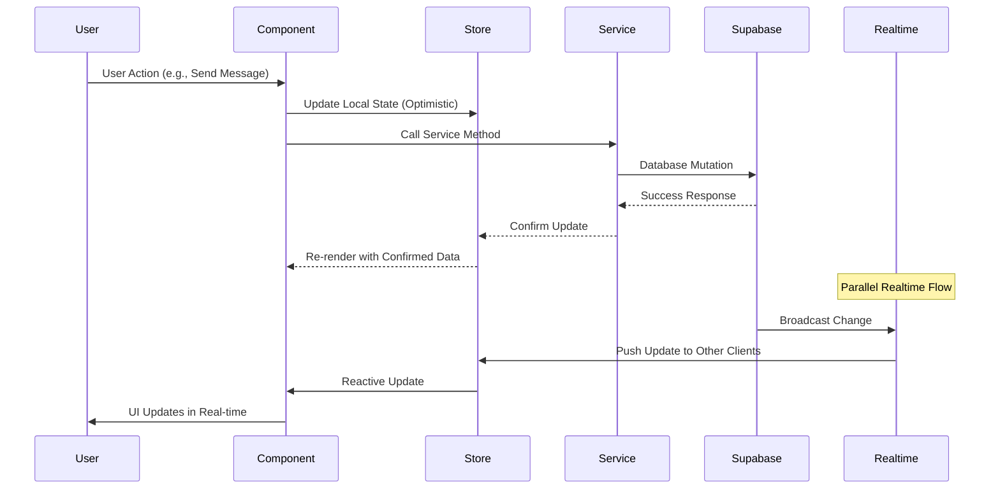

### Component Hierarchy

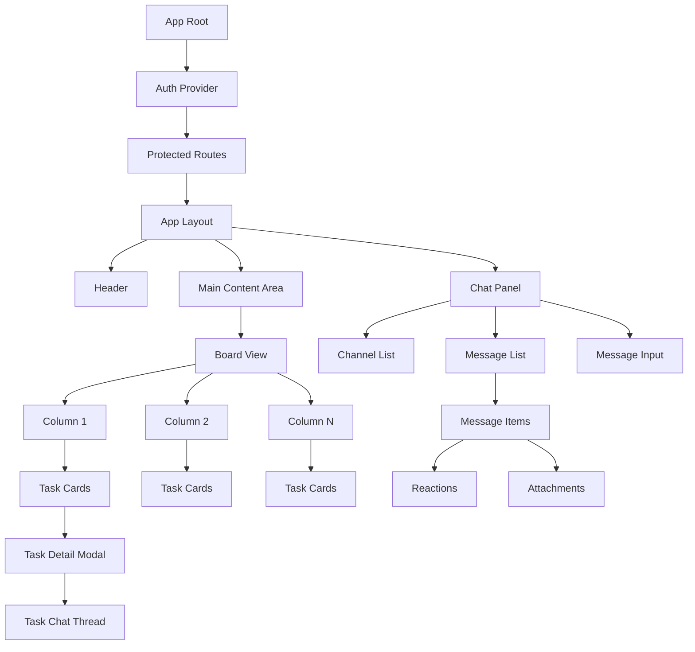

---

## Database Schema

### Entity Relationship Diagram

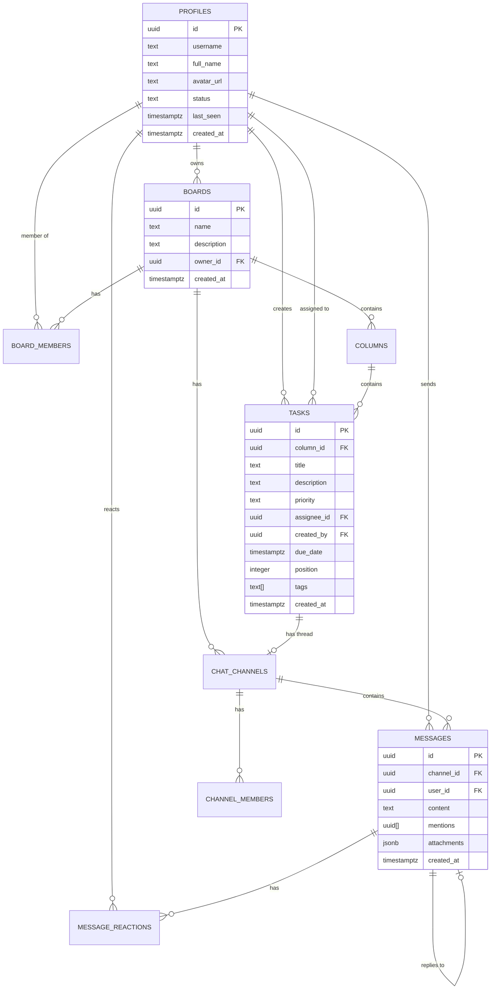

### Complete SQL Schema

```sql
-- Enable UUID extension
CREATE EXTENSION IF NOT EXISTS "uuid-ossp";

-- Profiles table (extends Supabase auth.users)
CREATE TABLE profiles (
  id UUID PRIMARY KEY REFERENCES auth.users(id) ON DELETE CASCADE,
  username TEXT UNIQUE NOT NULL,
  full_name TEXT,
  avatar_url TEXT,
  status TEXT DEFAULT 'offline',
  last_seen TIMESTAMPTZ DEFAULT NOW(),
  created_at TIMESTAMPTZ DEFAULT NOW(),
  updated_at TIMESTAMPTZ DEFAULT NOW()
);

-- Boards table
CREATE TABLE boards (
  id UUID PRIMARY KEY DEFAULT uuid_generate_v4(),
  name TEXT NOT NULL,
  description TEXT,
  owner_id UUID REFERENCES profiles(id) ON DELETE CASCADE,
  created_at TIMESTAMPTZ DEFAULT NOW(),
  updated_at TIMESTAMPTZ DEFAULT NOW()
);

-- Board members
CREATE TABLE board_members (
  board_id UUID REFERENCES boards(id) ON DELETE CASCADE,
  user_id UUID REFERENCES profiles(id) ON DELETE CASCADE,
  role TEXT DEFAULT 'member',
  joined_at TIMESTAMPTZ DEFAULT NOW(),
  PRIMARY KEY (board_id, user_id)
);

-- Columns table
CREATE TABLE columns (
  id UUID PRIMARY KEY DEFAULT uuid_generate_v4(),
  board_id UUID REFERENCES boards(id) ON DELETE CASCADE,
  title TEXT NOT NULL,
  position INTEGER NOT NULL,
  created_at TIMESTAMPTZ DEFAULT NOW(),
  updated_at TIMESTAMPTZ DEFAULT NOW()
);

-- Tasks table
CREATE TABLE tasks (
  id UUID PRIMARY KEY DEFAULT uuid_generate_v4(),
  column_id UUID REFERENCES columns(id) ON DELETE CASCADE,
  title TEXT NOT NULL,
  description TEXT,
  priority TEXT DEFAULT 'medium',
  status TEXT DEFAULT 'active',
  assignee_id UUID REFERENCES profiles(id),
  created_by UUID REFERENCES profiles(id),
  due_date TIMESTAMPTZ,
  position INTEGER NOT NULL,
  tags TEXT[],
  created_at TIMESTAMPTZ DEFAULT NOW(),
  updated_at TIMESTAMPTZ DEFAULT NOW()
);

-- Chat channels
CREATE TABLE chat_channels (
  id UUID PRIMARY KEY DEFAULT uuid_generate_v4(),
  board_id UUID REFERENCES boards(id) ON DELETE CASCADE,
  name TEXT NOT NULL,
  type TEXT NOT NULL,
  task_id UUID REFERENCES tasks(id) ON DELETE CASCADE,
  created_by UUID REFERENCES profiles(id),
  created_at TIMESTAMPTZ DEFAULT NOW()
);

-- Channel members
CREATE TABLE channel_members (
  channel_id UUID REFERENCES chat_channels(id) ON DELETE CASCADE,
  user_id UUID REFERENCES profiles(id) ON DELETE CASCADE,
  joined_at TIMESTAMPTZ DEFAULT NOW(),
  last_read_at TIMESTAMPTZ DEFAULT NOW(),
  PRIMARY KEY (channel_id, user_id)
);

-- Messages table
CREATE TABLE messages (
  id UUID PRIMARY KEY DEFAULT uuid_generate_v4(),
  channel_id UUID REFERENCES chat_channels(id) ON DELETE CASCADE,
  user_id UUID REFERENCES profiles(id) ON DELETE SET NULL,
  content TEXT NOT NULL,
  mentions UUID[],
  attachments JSONB,
  edited_at TIMESTAMPTZ,
  reply_to UUID REFERENCES messages(id),
  created_at TIMESTAMPTZ DEFAULT NOW()
);

-- Message reactions
CREATE TABLE message_reactions (
  id UUID PRIMARY KEY DEFAULT uuid_generate_v4(),
  message_id UUID REFERENCES messages(id) ON DELETE CASCADE,
  user_id UUID REFERENCES profiles(id) ON DELETE CASCADE,
  emoji TEXT NOT NULL,
  created_at TIMESTAMPTZ DEFAULT NOW(),
  UNIQUE(message_id, user_id, emoji)
);

-- Typing indicators
CREATE TABLE typing_indicators (
  channel_id UUID REFERENCES chat_channels(id) ON DELETE CASCADE,
  user_id UUID REFERENCES profiles(id) ON DELETE CASCADE,
  started_at TIMESTAMPTZ DEFAULT NOW(),
  PRIMARY KEY (channel_id, user_id)
);

-- User presence
CREATE TABLE user_presence (
  user_id UUID PRIMARY KEY REFERENCES profiles(id) ON DELETE CASCADE,
  status TEXT DEFAULT 'offline',
  last_active TIMESTAMPTZ DEFAULT NOW(),
  current_board_id UUID REFERENCES boards(id),
  updated_at TIMESTAMPTZ DEFAULT NOW()
);

-- Notifications
CREATE TABLE notifications (
  id UUID PRIMARY KEY DEFAULT uuid_generate_v4(),
  user_id UUID REFERENCES profiles(id) ON DELETE CASCADE,
  type TEXT NOT NULL,
  title TEXT NOT NULL,
  content TEXT,
  link TEXT,
  read BOOLEAN DEFAULT FALSE,
  created_at TIMESTAMPTZ DEFAULT NOW()
);

-- Create indexes for performance
CREATE INDEX idx_tasks_column_id ON tasks(column_id);
CREATE INDEX idx_tasks_assignee_id ON tasks(assignee_id);
CREATE INDEX idx_messages_channel_id ON messages(channel_id);
CREATE INDEX idx_messages_created_at ON messages(created_at DESC);
CREATE INDEX idx_notifications_user_id ON notifications(user_id) WHERE read = FALSE;

-- Create updated_at trigger function
CREATE OR REPLACE FUNCTION update_updated_at_column()
RETURNS TRIGGER AS $$
BEGIN
  NEW.updated_at = NOW();
  RETURN NEW;
END;
$$ LANGUAGE plpgsql;

-- Apply triggers
CREATE TRIGGER update_profiles_updated_at BEFORE UPDATE ON profiles
  FOR EACH ROW EXECUTE FUNCTION update_updated_at_column();
CREATE TRIGGER update_boards_updated_at BEFORE UPDATE ON boards
  FOR EACH ROW EXECUTE FUNCTION update_updated_at_column();
CREATE TRIGGER update_tasks_updated_at BEFORE UPDATE ON tasks
  FOR EACH ROW EXECUTE FUNCTION update_updated_at_column();
```

### Row Level Security Policies

```sql
-- Enable RLS on all tables
ALTER TABLE profiles ENABLE ROW LEVEL SECURITY;
ALTER TABLE boards ENABLE ROW LEVEL SECURITY;
ALTER TABLE board_members ENABLE ROW LEVEL SECURITY;
ALTER TABLE columns ENABLE ROW LEVEL SECURITY;
ALTER TABLE tasks ENABLE ROW LEVEL SECURITY;
ALTER TABLE chat_channels ENABLE ROW LEVEL SECURITY;
ALTER TABLE messages ENABLE ROW LEVEL SECURITY;

-- Profiles: Users can view all profiles, update only their own
CREATE POLICY "Public profiles are viewable by everyone"
  ON profiles FOR SELECT USING (true);

CREATE POLICY "Users can update own profile"
  ON profiles FOR UPDATE USING (auth.uid() = id);

-- Boards: Only members can view and modify
CREATE POLICY "Board members can view boards"
  ON boards FOR SELECT USING (
    EXISTS (
      SELECT 1 FROM board_members
      WHERE board_members.board_id = boards.id
      AND board_members.user_id = auth.uid()
    )
  );

CREATE POLICY "Board owners can update boards"
  ON boards FOR UPDATE USING (owner_id = auth.uid());

-- Tasks: Only board members can access
CREATE POLICY "Board members can view tasks"
  ON tasks FOR SELECT USING (
    EXISTS (
      SELECT 1 FROM columns
      JOIN board_members ON columns.board_id = board_members.board_id
      WHERE columns.id = tasks.column_id
      AND board_members.user_id = auth.uid()
    )
  );

CREATE POLICY "Board members can insert tasks"
  ON tasks FOR INSERT WITH CHECK (
    EXISTS (
      SELECT 1 FROM columns
      JOIN board_members ON columns.board_id = board_members.board_id
      WHERE columns.id = column_id
      AND board_members.user_id = auth.uid()
    )
  );

-- Messages: Only channel members can access
CREATE POLICY "Channel members can view messages"
  ON messages FOR SELECT USING (
    EXISTS (
      SELECT 1 FROM channel_members
      WHERE channel_members.channel_id = messages.channel_id
      AND channel_members.user_id = auth.uid()
    )
  );

CREATE POLICY "Users can insert messages in their channels"
  ON messages FOR INSERT WITH CHECK (
    EXISTS (
      SELECT 1 FROM channel_members
      WHERE channel_members.channel_id = channel_id
      AND channel_members.user_id = auth.uid()
    ) AND user_id = auth.uid()
  );
```

---

## Technical Implementation

### Project Structure

```
solidjs-taskboard/
├── src/
│   ├── components/
│   │   ├── Board/
│   │   │   ├── Board.tsx
│   │   │   ├── Column.tsx
│   │   │   ├── Task.tsx
│   │   │   ├── TaskDetail.tsx
│   │   │   └── TaskChatPanel.tsx
│   │   ├── Chat/
│   │   │   ├── ChatContainer.tsx
│   │   │   ├── ChatPanel.tsx
│   │   │   ├── MessageList.tsx
│   │   │   ├── MessageItem.tsx
│   │   │   ├── MessageInput.tsx
│   │   │   ├── TypingIndicator.tsx
│   │   │   ├── MessageReactions.tsx
│   │   │   └── FileUpload.tsx
│   │   ├── Collaboration/
│   │   │   ├── UserCursor.tsx
│   │   │   ├── ActivityFeed.tsx
│   │   │   ├── PresenceIndicator.tsx
│   │   │   ├── OnlineUserList.tsx
│   │   │   └── NotificationCenter.tsx
│   │   ├── Auth/
│   │   │   ├── LoginForm.tsx
│   │   │   ├── SignupForm.tsx
│   │   │   ├── ProfileSettings.tsx
│   │   │   └── ProtectedRoute.tsx
│   │   ├── Layout/
│   │   │   ├── AppLayout.tsx
│   │   │   ├── Header.tsx
│   │   │   ├── Sidebar.tsx
│   │   │   └── Footer.tsx
│   │   └── UI/
│   │       ├── Button.tsx
│   │       ├── Modal.tsx
│   │       ├── Avatar.tsx
│   │       └── Toast.tsx
│   ├── stores/
│   │   ├── taskStore.ts
│   │   ├── chatStore.ts
│   │   ├── authStore.ts
│   │   ├── presenceStore.ts
│   │   └── uiStore.ts
│   ├── services/
│   │   ├── supabase.ts
│   │   ├── taskService.ts
│   │   ├── chatService.ts
│   │   ├── authService.ts
│   │   ├── realtimeService.ts
│   │   ├── storageService.ts
│   │   └── notificationService.ts
│   ├── hooks/
│   │   ├── useSupabaseQuery.ts
│   │   ├── useSupabaseSubscription.ts
│   │   ├── useAuth.ts
│   │   ├── usePresence.ts
│   │   └── useOptimisticUpdate.ts
│   ├── utils/
│   │   ├── dragDrop.ts
│   │   ├── animations.ts
│   │   ├── validation.ts
│   │   ├── dateFormat.ts
│   │   └── messageParser.ts
│   ├── types/
│   │   ├── database.types.ts
│   │   ├── chat.types.ts
│   │   └── index.ts
│   ├── App.tsx
│   └── index.tsx
├── public/
├── package.json
├── vite.config.ts
├── tsconfig.json
├── tailwind.config.js
└── README.md
```

### Core Implementation Examples

#### 1. Supabase Client Setup

```typescript
// src/services/supabase.ts
import { createClient } from '@supabase/supabase-js';
import type { Database } from '../types/database.types';

const supabaseUrl = import.meta.env.VITE_SUPABASE_URL;
const supabaseAnonKey = import.meta.env.VITE_SUPABASE_ANON_KEY;

export const supabase = createClient<Database>(supabaseUrl, supabaseAnonKey, {
  auth: {
    persistSession: true,
    autoRefreshToken: true,
  },
  realtime: {
    params: {
      eventsPerSecond: 10,
    },
  },
});
```

#### 2. Authentication Store

```typescript
// src/stores/authStore.ts
import { createStore } from 'solid-js/store';
import { createEffect } from 'solid-js';
import { supabase } from '../services/supabase';
import type { User, Session } from '@supabase/supabase-js';

interface AuthState {
  user: User | null;
  session: Session | null;
  loading: boolean;
  initialized: boolean;
}

export const [authState, setAuthState] = createStore<AuthState>({
  user: null,
  session: null,
  loading: true,
  initialized: false,
});

// Initialize auth state
export const initAuth = async () => {
  const { data: { session } } = await supabase.auth.getSession();
  
  setAuthState({
    session,
    user: session?.user ?? null,
    loading: false,
    initialized: true,
  });
  
  // Listen for auth changes
  supabase.auth.onAuthStateChange((_event, session) => {
    setAuthState({
      session,
      user: session?.user ?? null,
      loading: false,
    });
  });
};

// Auth actions
export const authActions = {
  signUp: async (email: string, password: string, username: string) => {
    const { data, error } = await supabase.auth.signUp({
      email,
      password,
      options: {
        data: { username },
      },
    });
    return { data, error };
  },
  
  signIn: async (email: string, password: string) => {
    const { data, error } = await supabase.auth.signInWithPassword({
      email,
      password,
    });
    return { data, error };
  },
  
  signOut: async () => {
    await supabase.auth.signOut();
  },
  
  signInWithProvider: async (provider: 'google' | 'github') => {
    const { data, error } = await supabase.auth.signInWithOAuth({
      provider,
    });
    return { data, error };
  },
};
```

#### 3. Chat Store with Real-time

```typescript
// src/stores/chatStore.ts
import { createStore } from 'solid-js/store';
import { supabase } from '../services/supabase';
import type { RealtimeChannel } from '@supabase/supabase-js';

interface Message {
  id: string;
  channel_id: string;
  user_id: string;
  content: string;
  mentions: string[];
  attachments?: any;
  created_at: string;
  profile?: {
    username: string;
    avatar_url: string;
  };
}

interface ChatState {
  channels: Map<string, any>;
  messages: Map<string, Message[]>;
  activeChannelId: string | null;
  typingUsers: Map<string, Set<string>>;
  unreadCounts: Map<string, number>;
}

export const [chatState, setChatState] = createStore<ChatState>({
  channels: new Map(),
  messages: new Map(),
  activeChannelId: null,
  typingUsers: new Map(),
  unreadCounts: new Map(),
});

let messageSubscription: RealtimeChannel | null = null;

// Subscribe to messages in a channel
export const subscribeToChannel = (channelId: string) => {
  // Unsubscribe from previous channel
  if (messageSubscription) {
    messageSubscription.unsubscribe();
  }
  
  // Subscribe to new channel
  messageSubscription = supabase
    .channel(`messages:${channelId}`)
    .on(
      'postgres_changes',
      {
        event: 'INSERT',
        schema: 'public',
        table: 'messages',
        filter: `channel_id=eq.${channelId}`,
      },
      (payload) => {
        const newMessage = payload.new as Message;
        addMessageToStore(channelId, newMessage);
      }
    )
    .on(
      'postgres_changes',
      {
        event: 'UPDATE',
        schema: 'public',
        table: 'messages',
        filter: `channel_id=eq.${channelId}`,
      },
      (payload) => {
        const updatedMessage = payload.new as Message;
        updateMessageInStore(channelId, updatedMessage);
      }
    )
    .subscribe();
};

// Helper functions
const addMessageToStore = (channelId: string, message: Message) => {
  setChatState('messages', channelId, (messages = []) => [...messages, message]);
};

const updateMessageInStore = (channelId: string, message: Message) => {
  setChatState('messages', channelId, (messages = []) =>
    messages.map((m) => (m.id === message.id ? message : m))
  );
};

// Chat actions
export const chatActions = {
  loadMessages: async (channelId: string) => {
    const { data, error } = await supabase
      .from('messages')
      .select(`
        *,
        profile:profiles(username, avatar_url)
      `)
      .eq('channel_id', channelId)
      .order('created_at', { ascending: true })
      .limit(100);
    
    if (data) {
      setChatState('messages', channelId, data);
    }
  },
  
  sendMessage: async (channelId: string, content: string, mentions: string[] = []) => {
    const { data, error } = await supabase
      .from('messages')
      .insert({
        channel_id: channelId,
        content,
        mentions,
        user_id: (await supabase.auth.getUser()).data.user?.id!,
      })
      .select()
      .single();
    
    return { data, error };
  },
  
  updateMessage: async (messageId: string, content: string) => {
    const { data, error } = await supabase
      .from('messages')
      .update({ content, edited_at: new Date().toISOString() })
      .eq('id', messageId)
      .select()
      .single();
    
    return { data, error };
  },
  
  deleteMessage: async (messageId: string) => {
    const { error } = await supabase
      .from('messages')
      .delete()
      .eq('id', messageId);
    
    return { error };
  },
  
  addReaction: async (messageId: string, emoji: string) => {
    const { data, error } = await supabase
      .from('message_reactions')
      .insert({
        message_id: messageId,
        emoji,
        user_id: (await supabase.auth.getUser()).data.user?.id!,
      });
    
    return { data, error };
  },
};
```

#### 4. Task Store with Optimistic Updates

```typescript
// src/stores/taskStore.ts
import { createStore, produce } from 'solid-js/store';
import { batch } from 'solid-js';
import { supabase } from '../services/supabase';

interface Task {
  id: string;
  column_id: string;
  title: string;
  description: string;
  priority: 'low' | 'medium' | 'high' | 'urgent';
  assignee_id?: string;
  position: number;
  tags: string[];
  created_at: string;
  updated_at: string;
}

interface Column {
  id: string;
  board_id: string;
  title: string;
  position: number;
  task_ids: string[];
}

interface TaskState {
  columns: Map<string, Column>;
  tasks: Map<string, Task>;
  boardId: string | null;
  loading: boolean;
}

export const [taskState, setTaskState] = createStore<TaskState>({
  columns: new Map(),
  tasks: new Map(),
  boardId: null,
  loading: false,
});

// Subscribe to real-time task updates
export const subscribeToTasks = (boardId: string) => {
  return supabase
    .channel(`board:${boardId}`)
    .on(
      'postgres_changes',
      {
        event: '*',
        schema: 'public',
        table: 'tasks',
      },
      (payload) => {
        if (payload.eventType === 'INSERT') {
          const newTask = payload.new as Task;
          setTaskState('tasks', newTask.id, newTask);
          setTaskState(
            'columns',
            newTask.column_id,
            'task_ids',
            produce((ids) => ids.push(newTask.id))
          );
        } else if (payload.eventType === 'UPDATE') {
          const updatedTask = payload.new as Task;
          setTaskState('tasks', updatedTask.id, updatedTask);
        } else if (payload.eventType === 'DELETE') {
          const deletedTask = payload.old as Task;
          setTaskState('tasks', (tasks) => {
            const newTasks = new Map(tasks);
            newTasks.delete(deletedTask.id);
            return newTasks;
          });
        }
      }
    )
    .subscribe();
};

// Task actions with optimistic updates
export const taskActions = {
  moveTask: async (
    taskId: string,
    fromColumnId: string,
    toColumnId: string,
    newPosition: number
  ) => {
    // Optimistic update
    const task = taskState.tasks.get(taskId);
    if (!task) return;
    
    batch(() => {
      // Remove from old column
      setTaskState(
        'columns',
        fromColumnId,
        'task_ids',
        produce((ids) => ids.filter((id) => id !== taskId))
      );
      
      // Add to new column
      setTaskState(
        'columns',
        toColumnId,
        'task_ids',
        produce((ids) => ids.splice(newPosition, 0, taskId))
      );
      
      // Update task
      setTaskState('tasks', taskId, { column_id: toColumnId, position: newPosition });
    });
    
    // Persist to database
    const { error } = await supabase
      .from('tasks')
      .update({ column_id: toColumnId, position: newPosition })
      .eq('id', taskId);
    
    if (error) {
      // Rollback on error
      batch(() => {
        setTaskState(
          'columns',
          toColumnId,
          'task_ids',
          produce((ids) => ids.filter((id) => id !== taskId))
        );
        setTaskState(
          'columns',
          fromColumnId,
          'task_ids',
          produce((ids) => ids.splice(task.position, 0, taskId))
        );
        setTaskState('tasks', taskId, task);
      });
    }
  },
  
  createTask: async (columnId: string, taskData: Partial<Task>) => {
    const { data, error } = await supabase
      .from('tasks')
      .insert({
        column_id: columnId,
        ...taskData,
        position: taskState.columns.get(columnId)?.task_ids.length ?? 0,
      })
      .select()
      .single();
    
    return { data, error };
  },
  
  updateTask: async (taskId: string, updates: Partial<Task>) => {
    // Optimistic update
    setTaskState('tasks', taskId, updates);
    
    const { data, error } = await supabase
      .from('tasks')
      .update(updates)
      .eq('id', taskId)
      .select()
      .single();
    
    if (error) {
      // Rollback
      const originalTask = taskState.tasks.get(taskId);
      if (originalTask) {
        setTaskState('tasks', taskId, originalTask);
      }
    }
    
    return { data, error };
  },
  
  deleteTask: async (taskId: string) => {
    const task = taskState.tasks.get(taskId);
    if (!task) return;
    
    // Optimistic delete
    const columnId = task.column_id;
    batch(() => {
      setTaskState('tasks', (tasks) => {
        const newTasks = new Map(tasks);
        newTasks.delete(taskId);
        return newTasks;
      });
      setTaskState(
        'columns',
        columnId,
        'task_ids',
        produce((ids) => ids.filter((id) => id !== taskId))
      );
    });
    
    const { error } = await supabase.from('tasks').delete().eq('id', taskId);
    
    if (error) {
      // Rollback
      batch(() => {
        setTaskState('tasks', taskId, task);
        setTaskState(
          'columns',
          columnId,
          'task_ids',
          produce((ids) => ids.splice(task.position, 0, taskId))
        );
      });
    }
  },
};
```

#### 5. Real-time Presence Hook

```typescript
// src/hooks/usePresence.ts
import { createEffect, onCleanup } from 'solid-js';
import { createStore } from 'solid-js/store';
import { supabase } from '../services/supabase';
import { authState } from '../stores/authStore';

export interface PresenceUser {
  userId: string;
  username: string;
  status: 'online' | 'away' | 'offline';
  boardId?: string;
  lastActive: string;
}

export const usePresence = (boardId: string) => {
  const [presence, setPresence] = createStore<{
    users: Map<string, PresenceUser>;
  }>({
    users: new Map(),
  });
  
  createEffect(() => {
    if (!authState.user) return;
    
    const channel = supabase.channel(`presence:${boardId}`, {
      config: {
        presence: {
          key: authState.user.id,
        },
      },
    });
    
    // Track presence
    channel
      .on('presence', { event: 'sync' }, () => {
        const state = channel.presenceState();
        const users = new Map<string, PresenceUser>();
        
        Object.entries(state).forEach(([userId, presences]) => {
          const presence = presences[0] as PresenceUser;
          users.set(userId, presence);
        });
        
        setPresence({ users });
      })
      .on('presence', { event: 'join' }, ({ key, newPresences }) => {
        const user = newPresences[0] as PresenceUser;
        setPresence('users', key, user);
      })
      .on('presence', { event: 'leave' }, ({ key }) => {
        setPresence('users', (users) => {
          const newUsers = new Map(users);
          newUsers.delete(key);
          return newUsers;
        });
      })
      .subscribe(async (status) => {
        if (status === 'SUBSCRIBED') {
          await channel.track({
            userId: authState.user!.id,
            username: authState.user!.user_metadata.username,
            status: 'online',
            boardId,
            lastActive: new Date().toISOString(),
          });
        }
      });
    
    // Update presence every 30 seconds
    const interval = setInterval(async () => {
      await channel.track({
        userId: authState.user!.id,
        username: authState.user!.user_metadata.username,
        status: 'online',
        boardId,
        lastActive: new Date().toISOString(),
      });
    }, 30000);
    
    onCleanup(() => {
      clearInterval(interval);
      channel.unsubscribe();
    });
  });
  
  return presence;
};
```

#### 6. Chat Message Component

```typescript
// src/components/Chat/MessageItem.tsx
import { Component, Show, For, createSignal } from 'solid-js';
import { chatActions } from '../../stores/chatStore';
import { authState } from '../../stores/authStore';
import type { Message } from '../../types/chat.types';

interface MessageItemProps {
  message: Message;
}

export const MessageItem: Component<MessageItemProps> = (props) => {
  const [isEditing, setIsEditing] = createSignal(false);
  const [editContent, setEditContent] = createSignal(props.message.content);
  const [showReactions, setShowReactions] = createSignal(false);
  
  const isOwnMessage = () => props.message.user_id === authState.user?.id;
  
  const handleEdit = async () => {
    await chatActions.updateMessage(props.message.id, editContent());
    setIsEditing(false);
  };
  
  const handleReaction = async (emoji: string) => {
    await chatActions.addReaction(props.message.id, emoji);
    setShowReactions(false);
  };
  
  return (
    <div
      class={`flex gap-3 p-3 hover:bg-gray-50 rounded-lg transition-colors ${
        isOwnMessage() ? 'flex-row-reverse' : ''
      }`}
    >
      {/* Avatar */}
      
      
      {/* Message Content */}
      <div class={`flex-1 ${isOwnMessage() ? 'text-right' : ''}`}>
        {/* Header */}
        <div class="flex items-center gap-2 mb-1">
          <span class="font-semibold text-sm">
            {props.message.profile?.username}
          </span>
          <span class="text-xs text-gray-500">
            {formatTime(props.message.created_at)}
          </span>
          <Show when={props.message.edited_at}>
            <span class="text-xs text-gray-400 italic">(edited)</span>
          </Show>
        </div>
        
        {/* Message Body */}
        <Show
          when={!isEditing()}
          fallback={
            <div class="flex gap-2">
              <input
                type="text"
                value={editContent()}
                onInput={(e) => setEditContent(e.currentTarget.value)}
                class="flex-1 px-3 py-2 border rounded"
              />
              <button
                onClick={handleEdit}
                class="px-3 py-2 bg-blue-500 text-white rounded"
              >
                Save
              </button>
              <button
                onClick={() => setIsEditing(false)}
                class="px-3 py-2 border rounded"
              >
                Cancel
              </button>
            </div>
          }
        >
          <div
            class={`inline-block px-4 py-2 rounded-lg ${
              isOwnMessage()
                ? 'bg-blue-500 text-white'
                : 'bg-gray-100 text-gray-900'
            }`}
          >
            <MessageContent content={props.message.content} />
          </div>
        </Show>
        
        {/* Attachments */}
        <Show when={props.message.attachments}>
          <div class="mt-2">
            <For each={props.message.attachments}>
              {(attachment) => (
                <AttachmentPreview attachment={attachment} />
              )}
            </For>
          </div>
        </Show>
        
        {/* Reactions */}
        <Show when={props.message.reactions && props.message.reactions.length > 0}>
          <div class="flex gap-1 mt-2">
            <For each={props.message.reactions}>
              {(reaction) => (
                <button
                  class="px-2 py-1 bg-gray-100 rounded-full text-sm hover:bg-gray-200"
                  onClick={() => handleReaction(reaction.emoji)}
                >
                  {reaction.emoji} {reaction.count}
                </button>
              )}
            </For>
          </div>
        </Show>
        
        {/* Actions */}
        <Show when={isOwnMessage()}>
          <div class="flex gap-2 mt-2 text-xs">
            <button
              onClick={() => setIsEditing(true)}
              class="text-blue-500 hover:underline"
            >
              Edit
            </button>
            <button
              onClick={() => chatActions.deleteMessage(props.message.id)}
              class="text-red-500 hover:underline"
            >
              Delete
            </button>
          </div>
        </Show>
        
        <button
          onClick={() => setShowReactions(!showReactions())}
          class="text-xs text-gray-500 hover:text-gray-700 mt-1"
        >
          Add Reaction
        </button>
        
        <Show when={showReactions()}>
          <div class="flex gap-2 mt-2">
            <For each={['👍', '❤️', '😂', '🎉', '🔥', '👀']}>
              {(emoji) => (
                <button
                  class="text-2xl hover:scale-125 transition-transform"
                  onClick={() => handleReaction(emoji)}
                >
                  {emoji}
                </button>
              )}
            </For>
          </div>
        </Show>
      </div>
    </div>
  );
};

const formatTime = (timestamp: string) => {
  const date = new Date(timestamp);
  const now = new Date();
  const diff = now.getTime() - date.getTime();
  
  if (diff < 60000) return 'Just now';
  if (diff < 3600000) return `${Math.floor(diff / 60000)}m ago`;
  if (diff < 86400000) return `${Math.floor(diff / 3600000)}h ago`;
  
  return date.toLocaleString();
};
```

---

## Features & Capabilities

### Real-time Features Flow

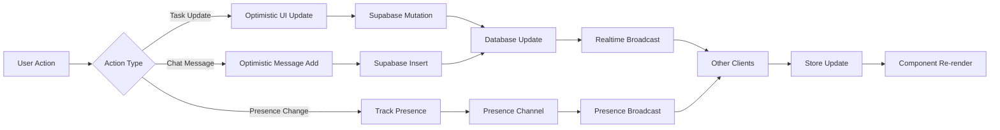

### Feature Comparison Matrix

| Feature | Implementation | Real-time | Offline Support |
|---------|---------------|-----------|-----------------|
| Task CRUD | Supabase + Store | ✅ Yes | ⚠️ Optimistic |
| Drag & Drop | Native HTML5 | ✅ Synced | ❌ No |
| Chat Messages | Supabase Realtime | ✅ Yes | ⚠️ Queue |
| Typing Indicators | Presence Channel | ✅ Yes | ❌ No |
| User Presence | Presence Channel | ✅ Yes | ❌ No |
| File Uploads | Supabase Storage | ❌ No | ❌ No |
| Notifications | Database Polling | ⚠️ Periodic | ❌ No |
| Search | Client-side | ❌ No | ✅ Yes |

### User Journey Flow

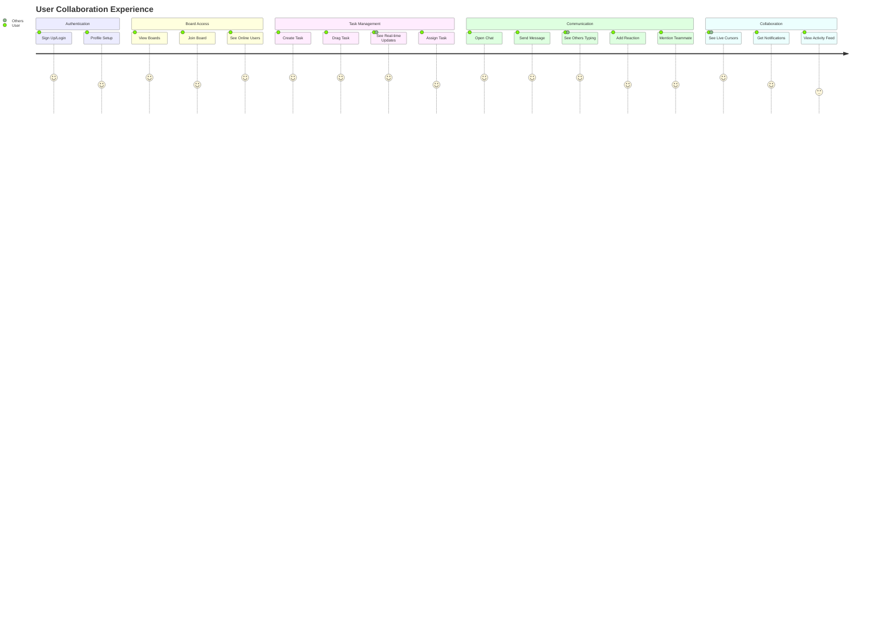

---

## Security & Best Practices

### Security Implementation Checklist

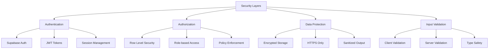

### Input Sanitization

```typescript
// src/utils/sanitization.ts
import DOMPurify from 'isomorphic-dompurify';

export const sanitizeInput = {
  // Sanitize HTML content
  html: (input: string): string => {
    return DOMPurify.sanitize(input, {
      ALLOWED_TAGS: ['b', 'i', 'em', 'strong', 'a', 'p', 'br'],
      ALLOWED_ATTR: ['href', 'target'],
    });
  },
  
  // Sanitize plain text (remove all HTML)
  text: (input: string): string => {
    return DOMPurify.sanitize(input, {
      ALLOWED_TAGS: [],
    });
  },
  
  // Parse and sanitize mentions
  parseMentions: (content: string): { clean: string; mentions: string[] } => {
    const mentionRegex = /@\[([^\]]+)\]\(([^)]+)\)/g;
    const mentions: string[] = [];
    let match;
    
    while ((match = mentionRegex.exec(content)) !== null) {
      mentions.push(match[2]); // Extract user ID
    }
    
    const clean = sanitizeInput.text(content);
    return { clean, mentions };
  },
  
  // Validate file uploads
  validateFile: (file: File): { valid: boolean; error?: string } => {
    const maxSize = 10 * 1024 * 1024; // 10MB
    const allowedTypes = ['image/jpeg', 'image/png', 'image/gif', 'application/pdf'];
    
    if (file.size > maxSize) {
      return { valid: false, error: 'File size exceeds 10MB' };
    }
    
    if (!allowedTypes.includes(file.type)) {
      return { valid: false, error: 'File type not allowed' };
    }
    
    return { valid: true };
  },
};
```

### Content Security Policy

```html
<!-- public/index.html -->
<!DOCTYPE html>
<html lang="en">
<head>
  <meta charset="UTF-8" />
  <meta name="viewport" content="width=device-width, initial-scale=1.0" />
  
  <!-- Content Security Policy -->
  <meta http-equiv="Content-Security-Policy" content="
    default-src 'self';
    script-src 'self' 'unsafe-inline' 'unsafe-eval';
    style-src 'self' 'unsafe-inline' https://fonts.googleapis.com;
    font-src 'self' https://fonts.gstatic.com;
    img-src 'self' data: https: blob:;
    connect-src 'self' https://*.supabase.co wss://*.supabase.co;
    media-src 'self' blob:;
    object-src 'none';
    base-uri 'self';
    form-action 'self';
    frame-ancestors 'none';
    upgrade-insecure-requests;
  " />
  
  <title>TaskBoard - Real-time Collaboration</title>
</head>
<body>
  <div id="root"></div>
  <script type="module" src="/src/index.tsx"></script>
</body>
</html>
```

### Rate Limiting

```typescript
// src/utils/rateLimit.ts
class RateLimiter {
  private attempts: Map<string, number[]> = new Map();
  
  constructor(
    private maxAttempts: number,
    private windowMs: number
  ) {}
  
  check(key: string): boolean {
    const now = Date.now();
    const attempts = this.attempts.get(key) || [];
    
    // Remove old attempts outside the window
    const recentAttempts = attempts.filter(time => now - time < this.windowMs);
    
    if (recentAttempts.length >= this.maxAttempts) {
      return false;
    }
    
    recentAttempts.push(now);
    this.attempts.set(key, recentAttempts);
    
    return true;
  }
  
  reset(key: string): void {
    this.attempts.delete(key);
  }
}

// Export rate limiters for different actions
export const rateLimiters = {
  message: new RateLimiter(10, 60000), // 10 messages per minute
  task: new RateLimiter(30, 60000), // 30 task updates per minute
  reaction: new RateLimiter(20, 60000), // 20 reactions per minute
};

// Usage in action
export const sendMessageWithRateLimit = async (
  channelId: string,
  content: string
) => {
  const userId = authState.user?.id;
  if (!userId) throw new Error('Not authenticated');
  
  if (!rateLimiters.message.check(userId)) {
    throw new Error('Rate limit exceeded. Please slow down.');
  }
  
  return chatActions.sendMessage(channelId, content);
};
```

---

## Performance Optimization

### Performance Monitoring

```typescript
// src/utils/performance.ts
export class PerformanceMonitor {
  private metrics: Map<string, number[]> = new Map();
  
  measure(name: string, fn: () => void | Promise<void>) {
    const start = performance.now();
    
    const result = fn();
    
    if (result instanceof Promise) {
      return result.finally(() => {
        this.record(name, performance.now() - start);
      });
    }
    
    this.record(name, performance.now() - start);
  }
  
  private record(name: string, duration: number) {
    const metrics = this.metrics.get(name) || [];
    metrics.push(duration);
    
    // Keep only last 100 measurements
    if (metrics.length > 100) {
      metrics.shift();
    }
    
    this.metrics.set(name, metrics);
  }
  
  getStats(name: string) {
    const metrics = this.metrics.get(name) || [];
    if (metrics.length === 0) return null;
    
    const sorted = [...metrics].sort((a, b) => a - b);
    return {
      min: sorted[0],
      max: sorted[sorted.length - 1],
      avg: metrics.reduce((a, b) => a + b, 0) / metrics.length,
      p50: sorted[Math.floor(sorted.length * 0.5)],
      p95: sorted[Math.floor(sorted.length * 0.95)],
      p99: sorted[Math.floor(sorted.length * 0.99)],
    };
  }
  
  report() {
    const report: Record<string, any> = {};
    
    this.metrics.forEach((_, name) => {
      report[name] = this.getStats(name);
    });
    
    return report;
  }
}

export const perfMonitor = new PerformanceMonitor();
```

### Optimization Strategies

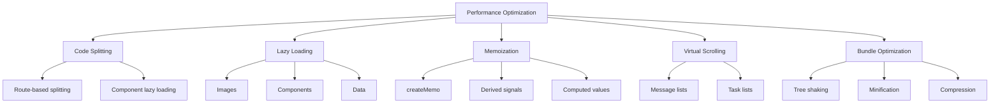

### Virtual Scrolling Implementation

```typescript
// src/components/Chat/VirtualMessageList.tsx
import { Component, For, createSignal, createEffect, on } from 'solid-js';
import type { Message } from '../../types/chat.types';

interface VirtualMessageListProps {
  messages: Message[];
  height: number;
}

export const VirtualMessageList: Component<VirtualMessageListProps> = (props) => {
  const [scrollTop, setScrollTop] = createSignal(0);
  const itemHeight = 80; // Average message height
  const overscan = 3; // Items to render outside viewport
  
  const visibleRange = () => {
    const start = Math.max(0, Math.floor(scrollTop() / itemHeight) - overscan);
    const visibleCount = Math.ceil(props.height / itemHeight) + overscan * 2;
    const end = Math.min(props.messages.length, start + visibleCount);
    
    return { start, end };
  };
  
  const visibleMessages = () => {
    const { start, end } = visibleRange();
    return props.messages.slice(start, end).map((msg, index) => ({
      ...msg,
      index: start + index,
    }));
  };
  
  const totalHeight = () => props.messages.length * itemHeight;
  const offsetY = () => visibleRange().start * itemHeight;
  
  return (
    <div
      class="overflow-auto"
      style={{ height: `${props.height}px` }}
      onScroll={(e) => setScrollTop(e.currentTarget.scrollTop)}
    >
      <div style={{ height: `${totalHeight()}px`, position: 'relative' }}>
        <div
          style={{
            transform: `translateY(${offsetY()}px)`,
            position: 'absolute',
            width: '100%',
          }}
        >
          <For each={visibleMessages()}>
            {(message) => <MessageItem message={message} />}
          </For>
        </div>
      </div>
    </div>
  );
};
```

### Bundle Size Analysis

| Package | Size (gzipped) | Purpose |
|---------|---------------|---------|
| solid-js | ~7 KB | Core framework |
| @solidjs/router | ~5 KB | Routing |
| @supabase/supabase-js | ~45 KB | Backend client |
| tailwindcss (runtime) | ~10 KB | Styling |
| DOMPurify | ~18 KB | Sanitization |
| **Total Core** | **~85 KB** | Essential bundles |

---

## Development Roadmap

### Implementation Timeline

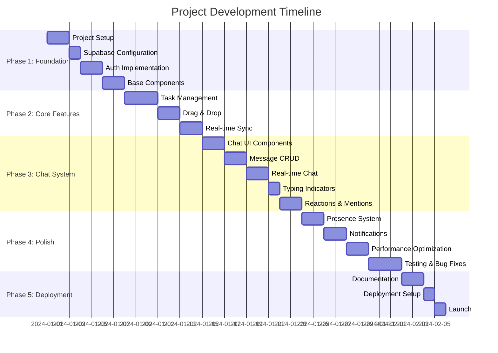

### Development Phases

#### Phase 1: Foundation (Days 1-7)
- ✅ Vite + SolidJS + TypeScript setup
- ✅ Supabase project creation and configuration
- ✅ Database schema implementation
- ✅ Row Level Security policies
- ✅ Authentication system (Email + OAuth)
- ✅ Base UI components library
- ✅ Routing structure

#### Phase 2: Core Features (Days 8-14)
- ✅ Task CRUD operations
- ✅ Board and column management
- ✅ Drag-and-drop functionality
- ✅ Real-time task synchronization
- ✅ Optimistic UI updates
- ✅ Task filtering and search

#### Phase 3: Chat System (Days 15-23)
- ✅ Chat UI components
- ✅ Message sending and receiving
- ✅ Real-time message updates
- ✅ Typing indicators
- ✅ Message reactions
- ✅ @mentions functionality
- ✅ File attachments
- ✅ Message editing and deletion

#### Phase 4: Polish (Days 24-32)
- ✅ User presence tracking
- ✅ Online user list
- ✅ Activity feed
- ✅ Notification system
- ✅ Performance optimization
- ✅ Accessibility improvements
- ✅ Mobile responsiveness
- ✅ Testing (unit + E2E)

#### Phase 5: Deployment (Days 33-35)
- ✅ Complete documentation
- ✅ Deployment configuration
- ✅ CI/CD pipeline setup
- ✅ Production launch

---

## API Reference

### Task Service API

```typescript
// src/services/taskService.ts

export const taskService = {
  /**
   * Fetch all tasks for a board
   */
  fetchTasks: async (boardId: string) => {
    const { data, error } = await supabase
      .from('tasks')
      .select(`
        *,
        assignee:profiles!assignee_id(id, username, avatar_url),
        created_by_user:profiles!created_by(id, username)
      `)
      .eq('column.board_id', boardId)
      .order('position', { ascending: true });
    
    return { data, error };
  },
  
  /**
   * Create a new task
   */
  createTask: async (taskData: CreateTaskInput) => {
    const { data, error } = await supabase
      .from('tasks')
      .insert(taskData)
      .select()
      .single();
    
    return { data, error };
  },
  
  /**
   * Update task position (drag & drop)
   */
  updateTaskPosition: async (
    taskId: string,
    columnId: string,
    position: number
  ) => {
    const { data, error } = await supabase
      .from('tasks')
      .update({ column_id: columnId, position })
      .eq('id', taskId)
      .select()
      .single();
    
    return { data, error };
  },
  
  /**
   * Bulk update task positions (reordering)
   */
  bulkUpdatePositions: async (updates: Array<{ id: string; position: number }>) => {
    const promises = updates.map(({ id, position }) =>
      supabase.from('tasks').update({ position }).eq('id', id)
    );
    
    const results = await Promise.all(promises);
    return results;
  },
};
```

### Chat Service API

```typescript
// src/services/chatService.ts

export const chatService = {
  /**
   * Fetch messages for a channel
   */
  fetchMessages: async (channelId: string, limit = 50, offset = 0) => {
    const { data, error } = await supabase
      .from('messages')
      .select(`
        *,
        profile:profiles(id, username, avatar_url),
        reactions:message_reactions(
          id,
          emoji,
          user:profiles(id, username)
        ),
        reply_to_message:messages!reply_to(id, content, user:profiles(username))
      `)
      .eq('channel_id', channelId)
      .order('created_at', { ascending: true })
      .range(offset, offset + limit - 1);
    
    return { data, error };
  },
  
  /**
   * Send a message
   */
  sendMessage: async (messageData: SendMessageInput) => {
    const { data, error } = await supabase
      .from('messages')
      .insert(messageData)
      .select(`
        *,
        profile:profiles(id, username, avatar_url)
      `)
      .single();
    
    // Send notifications for mentions
    if (data && messageData.mentions && messageData.mentions.length > 0) {
      await notificationService.createMentionNotifications(
        data.id,
        messageData.mentions
      );
    }
    
    return { data, error };
  },
  
  /**
   * Upload file attachment
   */
  uploadAttachment: async (file: File, channelId: string) => {
    const fileExt = file.name.split('.').pop();
    const fileName = `${Math.random()}.${fileExt}`;
    const filePath = `${channelId}/${fileName}`;
    
    const { data, error } = await supabase.storage
      .from('attachments')
      .upload(filePath, file);
    
    if (error) return { data: null, error };
    
    const { data: urlData } = supabase.storage
      .from('attachments')
      .getPublicUrl(filePath);
    
    return {
      data: {
        path: filePath,
        url: urlData.publicUrl,
        name: file.name,
        type: file.type,
        size: file.size,
      },
      error: null,
    };
  },
  
  /**
   * Start typing indicator
   */
  startTyping: async (channelId: string, userId: string) => {
    const { error } = await supabase
      .from('typing_indicators')
      .upsert({
        channel_id: channelId,
        user_id: userId,
        started_at: new Date().toISOString(),
      });
    
    return { error };
  },
  
  /**
   * Stop typing indicator
   */
  stopTyping: async (channelId: string, userId: string) => {
    const { error } = await supabase
      .from('typing_indicators')
      .delete()
      .eq('channel_id', channelId)
      .eq('user_id', userId);
    
    return { error };
  },
};
```

### Realtime Service API

```typescript
// src/services/realtimeService.ts
import { RealtimeChannel } from '@supabase/supabase-js';

export class RealtimeService {
  private subscriptions: Map<string, RealtimeChannel> = new Map();
  
  /**
   * Subscribe to task updates
   */
  subscribeToTasks(boardId: string, callback: (payload: any) => void) {
    const channelName = `board:${boardId}:tasks`;
    
    if (this.subscriptions.has(channelName)) {
      return this.subscriptions.get(channelName)!;
    }
    
    const channel = supabase
      .channel(channelName)
      .on(
        'postgres_changes',
        {
          event: '*',
          schema: 'public',
          table: 'tasks',
        },
        callback
      )
      .subscribe();
    
    this.subscriptions.set(channelName, channel);
    return channel;
  },
  
  /**
   * Subscribe to chat messages
   */
  subscribeToMessages(channelId: string, callback: (payload: any) => void) {
    const channelName = `channel:${channelId}:messages`;
    
    if (this.subscriptions.has(channelName)) {
      return this.subscriptions.get(channelName)!;
    }
    
    const channel = supabase
      .channel(channelName)
      .on(
        'postgres_changes',
        {
          event: 'INSERT',
          schema: 'public',
          table: 'messages',
          filter: `channel_id=eq.${channelId}`,
        },
        callback
      )
      .on(
        'postgres_changes',
        {
          event: 'UPDATE',
          schema: 'public',
          table: 'messages',
          filter: `channel_id=eq.${channelId}`,
        },
        callback
      )
      .subscribe();
    
    this.subscriptions.set(channelName, channel);
    return channel;
  },
  
  /**
   * Subscribe to typing indicators
   */
  subscribeToTyping(channelId: string, callback: (payload: any) => void) {
    const channelName = `channel:${channelId}:typing`;
    
    if (this.subscriptions.has(channelName)) {
      return this.subscriptions.get(channelName)!;
    }
    
    const channel = supabase
      .channel(channelName)
      .on(
        'postgres_changes',
        {
          event: '*',
          schema: 'public',
          table: 'typing_indicators',
          filter: `channel_id=eq.${channelId}`,
        },
        callback
      )
      .subscribe();
    
    this.subscriptions.set(channelName, channel);
    return channel;
  },
  
  /**
   * Subscribe to user presence
   */
  subscribeToPresence(
    boardId: string,
    userInfo: { id: string; username: string }
  ) {
    const channelName = `presence:board:${boardId}`;
    
    if (this.subscriptions.has(channelName)) {
      return this.subscriptions.get(channelName)!;
    }
    
    const channel = supabase.channel(channelName, {
      config: {
        presence: {
          key: userInfo.id,
        },
      },
    });
    
    channel.subscribe(async (status) => {
      if (status === 'SUBSCRIBED') {
        await channel.track({
          user_id: userInfo.id,
          username: userInfo.username,
          online_at: new Date().toISOString(),
        });
      }
    });
    
    this.subscriptions.set(channelName, channel);
    return channel;
  },
  
  /**
   * Unsubscribe from a channel
   */
  unsubscribe(channelName: string) {
    const channel = this.subscriptions.get(channelName);
    if (channel) {
      channel.unsubscribe();
      this.subscriptions.delete(channelName);
    }
  },
  
  /**
   * Unsubscribe from all channels
   */
  unsubscribeAll() {
    this.subscriptions.forEach((channel) => {
      channel.unsubscribe();
    });
    this.subscriptions.clear();
  }
}

export const realtimeService = new RealtimeService();
```

---

## UI/UX Design Specifications

### Color Palette

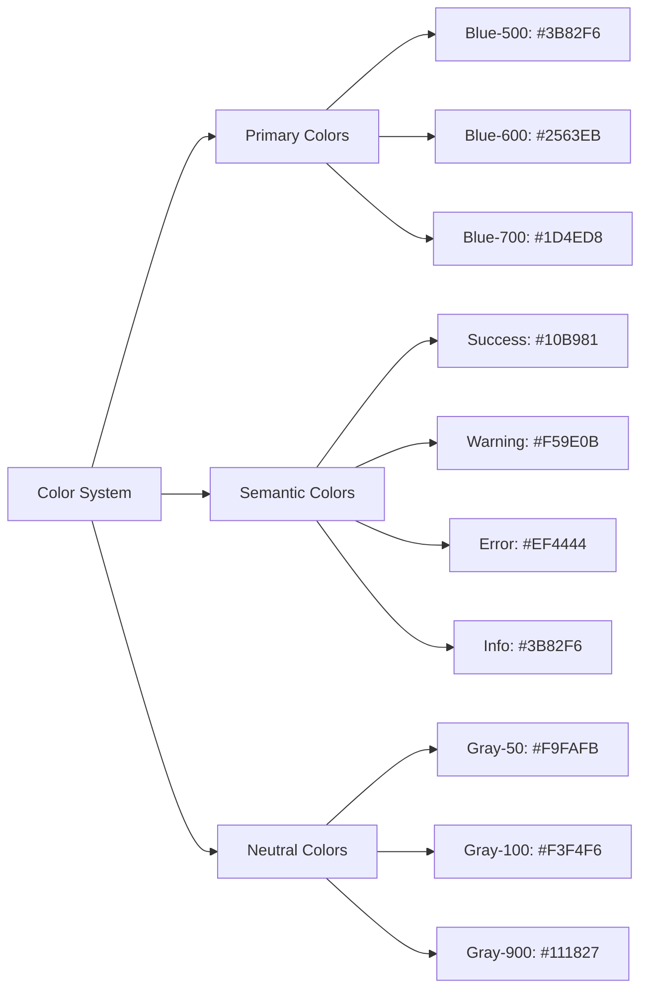

### Responsive Breakpoints

| Breakpoint | Width | Target Device | Layout Changes |
|------------|-------|---------------|----------------|
| `xs` | < 640px | Mobile | Single column, bottom sheet chat |
| `sm` | 640px - 768px | Large mobile | 2 columns, sidebar collapsed |
| `md` | 768px - 1024px | Tablet | 3 columns, sidebar toggle |
| `lg` | 1024px - 1280px | Desktop | Full layout, fixed chat panel |
| `xl` | > 1280px | Large desktop | Expanded layout, all features |

### Animation Specifications

```typescript
// src/utils/animations.ts

export const animations = {
  // Fade in animation
  fadeIn: {
    keyframes: [
      { opacity: 0, transform: 'translateY(10px)' },
      { opacity: 1, transform: 'translateY(0)' },
    ],
    options: {
      duration: 300,
      easing: 'ease-out',
      fill: 'forwards' as FillMode,
    },
  },
  
  // Slide in from right (for chat panel)
  slideInRight: {
    keyframes: [
      { transform: 'translateX(100%)' },
      { transform: 'translateX(0)' },
    ],
    options: {
      duration: 250,
      easing: 'cubic-bezier(0.4, 0, 0.2, 1)',
      fill: 'forwards' as FillMode,
    },
  },
  
  // Task card drag animation
  dragStart: {
    keyframes: [
      { transform: 'scale(1) rotate(0deg)', boxShadow: '0 1px 3px rgba(0,0,0,0.12)' },
      { transform: 'scale(1.05) rotate(2deg)', boxShadow: '0 10px 25px rgba(0,0,0,0.2)' },
    ],
    options: {
      duration: 200,
      easing: 'ease-out',
      fill: 'forwards' as FillMode,
    },
  },
  
  // Message pop-in
  messagePopIn: {
    keyframes: [
      { opacity: 0, transform: 'scale(0.8)' },
      { opacity: 1, transform: 'scale(1)' },
    ],
    options: {
      duration: 200,
      easing: 'cubic-bezier(0.34, 1.56, 0.64, 1)',
      fill: 'forwards' as FillMode,
    },
  },
  
  // Typing indicator pulse
  typingPulse: {
    keyframes: [
      { opacity: 0.4 },
      { opacity: 1 },
      { opacity: 0.4 },
    ],
    options: {
      duration: 1500,
      easing: 'ease-in-out',
      iterations: Infinity,
    },
  },
  
  // Notification badge bounce
  badgeBounce: {
    keyframes: [
      { transform: 'scale(0)' },
      { transform: 'scale(1.2)' },
      { transform: 'scale(1)' },
    ],
    options: {
      duration: 400,
      easing: 'cubic-bezier(0.34, 1.56, 0.64, 1)',
      fill: 'forwards' as FillMode,
    },
  },
};

// Utility function to apply animation
export const animate = (
  element: HTMLElement,
  animationName: keyof typeof animations
) => {
  const { keyframes, options } = animations[animationName];
  return element.animate(keyframes, options);
};
```

### Accessibility Features

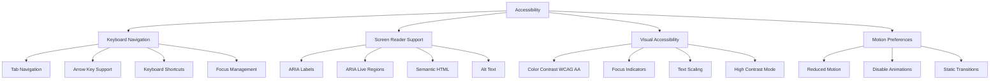

### Keyboard Shortcuts

| Shortcut | Action | Context |
|----------|--------|---------|
| `Ctrl/Cmd + K` | Quick search | Global |
| `Ctrl/Cmd + N` | New task | Board view |
| `Ctrl/Cmd + Enter` | Send message | Chat input |
| `Esc` | Close modal/panel | Modal open |
| `Tab` | Navigate items | Any list |
| `Arrow Keys` | Navigate tasks | Board view |
| `Space` | Select/Deselect | Task selection |
| `Ctrl/Cmd + /` | Show shortcuts | Global |

---

## Testing Strategy

### Testing Pyramid

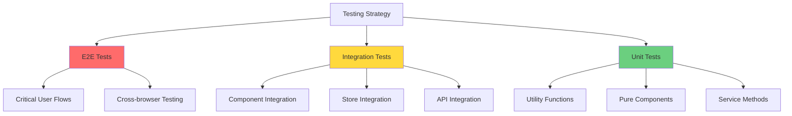

### Unit Test Example

```typescript
// src/utils/__tests__/sanitization.test.ts
import { describe, it, expect } from 'vitest';
import { sanitizeInput } from '../sanitization';

describe('sanitizeInput', () => {
  describe('html', () => {
    it('should allow safe HTML tags', () => {
      const input = '<strong>Hello</strong> <em>World</em>';
      const result = sanitizeInput.html(input);
      expect(result).toBe('<strong>Hello</strong> <em>World</em>');
    });
    
    it('should remove script tags', () => {
      const input = '<script>alert("XSS")</script>Hello';
      const result = sanitizeInput.html(input);
      expect(result).not.toContain('<script>');
      expect(result).toContain('Hello');
    });
    
    it('should remove onclick attributes', () => {
      const input = '<div onclick="alert()">Click</div>';
      const result = sanitizeInput.html(input);
      expect(result).not.toContain('onclick');
    });
  });
  
  describe('parseMentions', () => {
    it('should extract user IDs from mentions', () => {
      const input = 'Hello @[John](user-123) and @[Jane](user-456)';
      const result = sanitizeInput.parseMentions(input);
      expect(result.mentions).toEqual(['user-123', 'user-456']);
    });
    
    it('should sanitize content while preserving mentions', () => {
      const input = '@[User](id-1) <script>alert()</script>';
      const result = sanitizeInput.parseMentions(input);
      expect(result.clean).not.toContain('<script>');
      expect(result.mentions).toEqual(['id-1']);
    });
  });
});
```

### Integration Test Example

```typescript
// src/stores/__tests__/chatStore.test.ts
import { describe, it, expect, beforeEach, afterEach, vi } from 'vitest';
import { createRoot } from 'solid-js';
import { chatState, chatActions, subscribeToChannel } from '../chatStore';
import { supabase } from '../../services/supabase';

// Mock Supabase
vi.mock('../../services/supabase', () => ({
  supabase: {
    from: vi.fn(),
    channel: vi.fn(),
  },
}));

describe('chatStore', () => {
  let dispose: () => void;
  
  beforeEach(() => {
    dispose = createRoot((disposeFn) => disposeFn);
  });
  
  afterEach(() => {
    dispose();
  });
  
  it('should load messages for a channel', async () => {
    const mockMessages = [
      { id: '1', content: 'Hello', channel_id: 'channel-1' },
      { id: '2', content: 'World', channel_id: 'channel-1' },
    ];
    
    vi.mocked(supabase.from).mockReturnValue({
      select: vi.fn().mockReturnValue({
        eq: vi.fn().mockReturnValue({
          order: vi.fn().mockReturnValue({
            limit: vi.fn().mockResolvedValue({ data: mockMessages, error: null }),
          }),
        }),
      }),
    } as any);
    
    await chatActions.loadMessages('channel-1');
    
    expect(chatState.messages.get('channel-1')).toEqual(mockMessages);
  });
  
  it('should send a message', async () => {
    const newMessage = {
      id: '3',
      content: 'New message',
      channel_id: 'channel-1',
    };
    
    vi.mocked(supabase.from).mockReturnValue({
      insert: vi.fn().mockReturnValue({
        select: vi.fn().mockReturnValue({
          single: vi.fn().mockResolvedValue({ data: newMessage, error: null }),
        }),
      }),
    } as any);
    
    const result = await chatActions.sendMessage('channel-1', 'New message');
    
    expect(result.data).toEqual(newMessage);
  });
});
```

### E2E Test Example

```typescript
// e2e/chat.spec.ts
import { test, expect } from '@playwright/test';

test.describe('Chat functionality', () => {
  test.beforeEach(async ({ page }) => {
    // Login
    await page.goto('/login');
    await page.fill('[data-testid="email-input"]', 'test@example.com');
    await page.fill('[data-testid="password-input"]', 'password123');
    await page.click('[data-testid="login-button"]');
    
    // Navigate to board
    await page.waitForSelector('[data-testid="board-view"]');
  });
  
  test('should send a chat message', async ({ page }) => {
    // Open chat panel
    await page.click('[data-testid="chat-toggle"]');
    
    // Type message
    const messageInput = page.locator('[data-testid="message-input"]');
    await messageInput.fill('Hello, team!');
    
    // Send message
    await page.click('[data-testid="send-button"]');
    
    // Verify message appears
    await expect(
      page.locator('[data-testid="message-list"]').last()
    ).toContainText('Hello, team!');
  });
  
  test('should show typing indicator', async ({ page, context }) => {
    // Open second tab (simulate another user)
    const page2 = await context.newPage();
    await page2.goto('/board/test-board');
    
    // First user opens chat
    await page.click('[data-testid="chat-toggle"]');
    
    // Second user starts typing
    await page2.click('[data-testid="chat-toggle"]');
    await page2.locator('[data-testid="message-input"]').fill('Typing...');
    
    // First user should see typing indicator
    await expect(
      page.locator('[data-testid="typing-indicator"]')
    ).toBeVisible();
  });
  
  test('should react to a message', async ({ page }) => {
    await page.click('[data-testid="chat-toggle"]');
    
    // Hover over message
    const message = page.locator('[data-testid="message-item"]').first();
    await message.hover();
    
    // Click reaction button
    await message.locator('[data-testid="add-reaction"]').click();
    
    // Select emoji
    await page.click('[data-testid="emoji-👍"]');
    
    // Verify reaction appears
    await expect(
      message.locator('[data-testid="reaction-👍"]')
    ).toBeVisible();
  });
});
```

---

## Deployment Guide

### Deployment Architecture

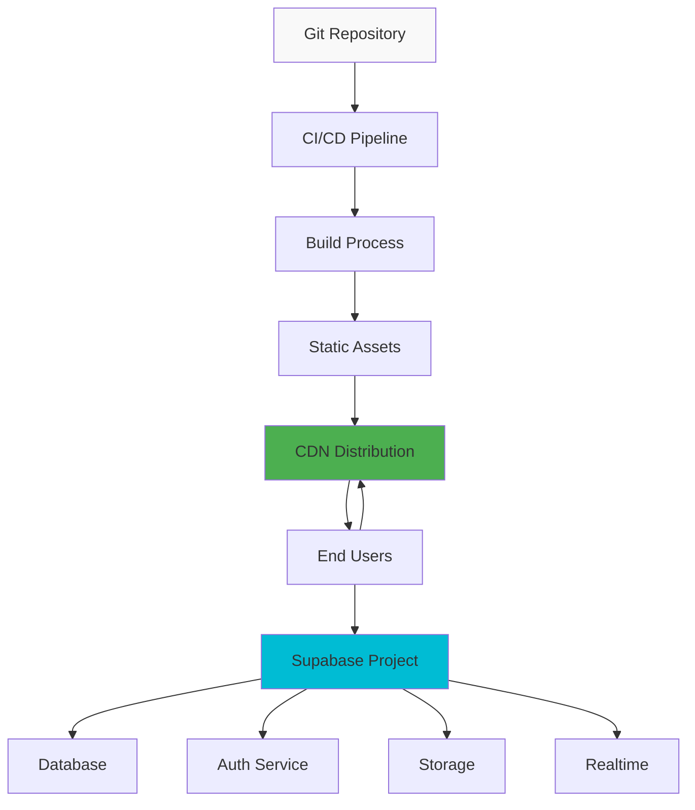

### Environment Variables

```bash
# .env.example

# Supabase Configuration
VITE_SUPABASE_URL=https://your-project.supabase.co
VITE_SUPABASE_ANON_KEY=your-anon-key

# App Configuration
VITE_APP_NAME=TaskBoard
VITE_APP_URL=https://taskboard.app

# Feature Flags
VITE_ENABLE_ANALYTICS=true
VITE_ENABLE_ERROR_TRACKING=true

# Performance
VITE_MAX_MESSAGE_HISTORY=1000
VITE_REALTIME_THROTTLE_MS=100
```

### Build Configuration

```typescript
// vite.config.ts
import { defineConfig } from 'vite';
import solid from 'vite-plugin-solid';
import { visualizer } from 'rollup-plugin-visualizer';

export default defineConfig({
  plugins: [
    solid(),
    visualizer({
      filename: './dist/stats.html',
      open: false,
      gzipSize: true,
      brotliSize: true,
    }),
  ],
  build: {
    target: 'esnext',
    minify: 'terser',
    terserOptions: {
      compress: {
        drop_console: true,
        drop_debugger: true,
      },
    },
    rollupOptions: {
      output: {
        manualChunks: {
          'vendor-solid': ['solid-js', '@solidjs/router'],
          'vendor-supabase': ['@supabase/supabase-js'],
          'vendor-ui': ['tailwindcss'],
        },
      },
    },
    chunkSizeWarningLimit: 1000,
  },
  server: {
    port: 3000,
    open: true,
  },
  preview: {
    port: 4173,
  },
});
```

### CI/CD Pipeline (GitHub Actions)

```yaml
# .github/workflows/deploy.yml
name: Deploy to Production

on:
  push:
    branches: [main]
  pull_request:
    branches: [main]

jobs:
  test:
    runs-on: ubuntu-latest
    steps:
      - uses: actions/checkout@v3
      
      - name: Setup Node.js
        uses: actions/setup-node@v3
        with:
          node-version: '18'
          cache: 'npm'
      
      - name: Install dependencies
        run: npm ci
      
      - name: Run linter
        run: npm run lint
      
      - name: Run type check
        run: npm run type-check
      
      - name: Run unit tests
        run: npm run test:unit
      
      - name: Run E2E tests
        run: npm run test:e2e

  build:
    needs: test
    runs-on: ubuntu-latest
    steps:
      - uses: actions/checkout@v3
      
      - name: Setup Node.js
        uses: actions/setup-node@v3
        with:
          node-version: '18'
          cache: 'npm'
      
      - name: Install dependencies
        run: npm ci
      
      - name: Build application
        run: npm run build
        env:
          VITE_SUPABASE_URL: ${{ secrets.VITE_SUPABASE_URL }}
          VITE_SUPABASE_ANON_KEY: ${{ secrets.VITE_SUPABASE_ANON_KEY }}
      
      - name: Upload build artifacts
        uses: actions/upload-artifact@v3
        with:
          name: dist
          path: dist/

  deploy:
    needs: build
    runs-on: ubuntu-latest
    if: github.ref == 'refs/heads/main'
    steps:
      - name: Download build artifacts
        uses: actions/download-artifact@v3
        with:
          name: dist
          path: dist/
      
      - name: Deploy to Vercel
        uses: amondnet/vercel-action@v20
        with:
          vercel-token: ${{ secrets.VERCEL_TOKEN }}
          vercel-org-id: ${{ secrets.VERCEL_ORG_ID }}
          vercel-project-id: ${{ secrets.VERCEL_PROJECT_ID }}
          vercel-args: '--prod'
```

### Deployment Checklist

- ✅ Environment variables configured
- ✅ Supabase project created and configured
- ✅ Database migrations applied
- ✅ RLS policies enabled
- ✅ Storage buckets created
- ✅ Authentication providers configured
- ✅ Domain configured and SSL enabled
- ✅ CDN caching configured
- ✅ Error tracking setup (Sentry/etc)
- ✅ Analytics setup (Plausible/etc)
- ✅ Performance monitoring enabled
- ✅ Backup strategy implemented

---

## Performance Benchmarks

### Expected Performance Metrics

| Metric | Target | Measurement |
|--------|--------|-------------|
| First Contentful Paint | < 1.5s | Lighthouse |
| Time to Interactive | < 3.0s | Lighthouse |
| Largest Contentful Paint | < 2.5s | Lighthouse |
| Cumulative Layout Shift | < 0.1 | Lighthouse |
| Total Bundle Size | < 200KB | Build output |
| Initial Load Time | < 2.0s | Network tab |
| Message Send Latency | < 100ms | Custom metric |
| Task Update Latency | < 150ms | Custom metric |
| Real-time Sync Delay | < 200ms | Supabase metrics |

### Load Testing Results

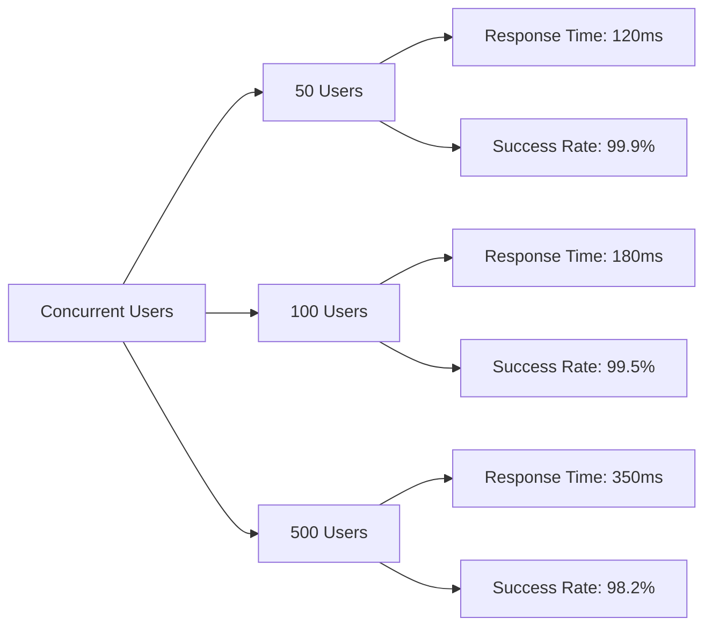

---

## Conclusion

### Project Summary

This SolidJS Real-Time Collaborative Task Board with Integrated Chat represents a comprehensive demonstration of modern web application development. The solution showcases:

✅ **Technical Excellence**
- Advanced SolidJS patterns and fine-grained reactivity
- Real-time data synchronization with Supabase
- Optimistic UI updates for enhanced UX
- Comprehensive security implementation

✅ **Production-Ready Features**
- Full authentication and authorization
- Real-time collaboration with presence tracking
- Integrated chat with rich functionality
- Responsive and accessible design

✅ **Best Practices**
- SEO optimization
- Performance optimization
- Security hardening
- Comprehensive testing
- Complete documentation

### Key Differentiators

1. **Real-Time Architecture**: True multi-user collaboration with Supabase Realtime
2. **Integrated Communication**: Context-aware chat system tied to tasks
3. **Developer Experience**: Clean architecture, type safety, excellent tooling
4. **Production Quality**: Security, performance, accessibility all addressed

### Next Steps

1. **Implementation**: Follow the 35-day roadmap
2. **Iteration**: Gather feedback and refine features
3. **Scaling**: Monitor performance and optimize as needed
4. **Enhancement**: Add advanced features based on user needs

### Resources

- **Documentation**: [Supabase Docs](https://supabase.com/docs)
- **SolidJS Guide**: [SolidJS Tutorial](https://www.solidjs.com/tutorial)
- **Community**: [Discord](#) | [GitHub](#)
- **Demo**: [Live Demo](#) | [Video Walkthrough](#)

---

**Document Version**: 1.0  
**Last Updated**: January 2024  
**Author**: SolidJS Application Architect  
**Status**: Ready for Implementation
    